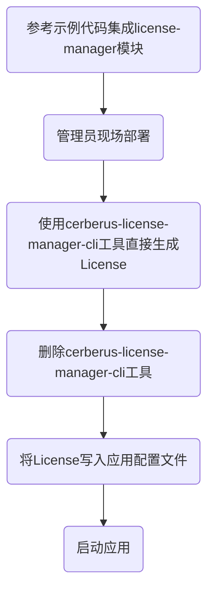
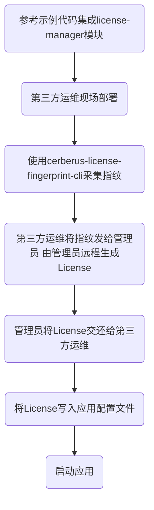

# CERBERUS-LICENSE

## 简介
CERBERUS-LICENSE是一个Java环境下的License授权管理组件。

在不考虑应用被恶意破解/反编译的前提下，可以为部署在客户现场的Java应用，提供简单易用、相对安全的授权管理方案。

主要解决以下痛点:  
1. 绑定硬件指纹信息，使应用只能运行在当前主机下
2. 校验授权有效期，超期后应用可以暂停服务

--------------------------------

## 功能特性
1. 通过采集网卡、IP、CPU、主板信息综合计算出硬件指纹，比单纯使用MAC地址计算更加可靠。
2. 提供一个指纹采集工具，支持Linux/Windows/macOS。
3. License格式约定大于配置，包含固定的授权类型、有效期等字段，可满足大部分需求。
4. License包含一个附加信息字段，不限定格式，可以存储更加详细的授权控制列表等信息。
5. License使用非对称加密算法进行签名，防止恶意伪造。
6. 提供了CLI/GUI/API三种方式的管理接口，方便各种场合下使用、嵌入。
7. 提供一个SpringMVC的示例工程，演示AOP/Filter/Interceptor 3种整合方式。

--------------------------------

## 快速入门
以下是一个较为简化的场景，用于展示CERBERUS-LICENSE使用上的便捷。

### Step1. 应用改造
将`cerberus-license-manager`加入pom依赖。

参考`cerberus-license-sample-springmvc`工程，将`LisenseInitConfiguration.java`和`LicenseVerifyAspect.java`配置集成进工程内部，用于读取、校验License。

### Step2. 生成License
在需要部署应用的主机中执行`cerberus-license-manager-cli-1.0.0.jar`，传入授权时长等信息，生成License。

```
$ java -jar cerberus-license-manager-cli-1.0.0.jar --subject=sample-project --type=BASIC --period=36

eyJsaWNlbnNlSWQiOiI2OUJDQ0NEMEU1MTc0OUQwOTRCNzZDNjNFOTVBQjBBRSIsInN1YmplY3QiOiJzYW1wbGUtcHJvamVjdCIsImlzc3VlZ
```

> License生成之后，请**及时删除**`cerberus-license-manager-cli-1.0.0.jar`，因为jar包中内置了签名用的私钥，需要防止泄漏。  
> 此操作仅能由管理员完成，如果需要第三方人员部署，请务必阅读指纹采集相关章节。

### Step3. 配置、启动应用
将刚才生成的License，写入这台主机下的应用的配置文件，启动应用即可。

--------------------------------

## 模块简介
模块 | 用途 | 简介
---- | ---- | ----
cerberus-license-fingerprint | 硬件指纹采集模块 | 通过采集网卡、IP、CPU、主板信息，计算出当前硬件指纹
cerberus-license-manager | License管理模块 | 提供生成、校验License的核心功能
cerberus-license-fingerprint-cli | 硬件指纹采集工具(命令行界面) | 命令行方式采集硬件指纹，可提供给第三方运维人员使用
cerberus-license-manager-cli | License管理工具(命令行界面) | 用于在命令行下生成License，管理员使用
cerberus-license-manager-gui | License管理工具(图形界面) |  用于在桌面环境下生成License，管理员使用
cerberus-license-manager-api | License管理工具(API接口) | 提供一组Rest服务，用于生成License，可集成进第三方应用的管理平台
cerberus-license-sample-springmvc | SpringMVC工程示例 | SpringMVC工程的集成样例，包含License配置与有效期校验相关代码

--------------------------------

## License的构成
为了方便使用，License默认编码成文本格式，以便直接配置在application.yml中

文本编码后的License大概是这个样子: 
```
eyJsaWNlbnNlSWQiOiI0NDVFREVBNkRCQkQ0NDU1ODhFQkI5QjNCNTk2NjNBNSIsInN1YmplY3QiOiJZb3VyU3
lzdGVtTmFtZSIsImlzc3VlZERhdGUiOiIyMDE5LTA5LTE2IDAxOjU1OjU1IiwiZXhwaXJlRGF0ZSI6IjIwMjEt
MDktMTYgMDE6NTU6NTUiLCJhdXRoVHlwZSI6IkJBU0lDIiwiZmluZ2VycHJpbnQiOiI1ZmJiNDE1NzUyYThmOD
QyOGM0NGUwZWNkMDU2ZGU3YjVlYTZmY2RjNjY2OWFiMTk5NGM0Nz
```

当然也可以存储为`yourlicense.lic`文件，放置在应用外部，读取后使用。


License中包含的信息，有如下几个字段:  

字段名 | 解释 | 备注
---- | ---- | ---
licenseId | UUID | 自动生成
subject | 主题 | 描述系统名称、版本号等
issuedDate | 签发时间 | 自动生成
expireDate | 截止时间 | 需手工设置
authType | 授权类型 | 手工设置，例如BASIC、PRO等授权级别
fingerprint | 主机指纹 | 用于匹配当前主机
extra | 附加信息 | 不限定格式
sign | 签名 | 自动生成，对于之前所有内容的签名


以下是一个用JSON来展现的，简单的样例: 
```json
{
    "licenseId": "445EDEA6DBBD445588EBB9B3B59663A5",
    "subject": "YourSystemName",
    "issuedDate": "2019-09-16 01:55:55",
    "expireDate": "2021-09-16 01:55:55",
    "authType": "BASIC",
    "fingerprint": "5fbb415752a8f8428c44e0ecd056de7b5ea6fcdc6669ab1994c476dca65c85e9",
    "extra": "",
    "sign": "WMwUXZDGes+yNi0TFmgzFkvxUxEzMNWYzLE9LqjdoHnE6gd91z5"
}
```

最终，License会通过特定算法进行转换、编码，形成上面的那个字符串。

--------------------------------

## 整体流程简介
部署方式可以分为两类:
1. 由管理员直接在客户现场部署，流程相对简单
2. 交由第三方运维人员部署，需要单独采集硬件指纹

### 流程1: 管理员直接部署

管理员使用cerberus-license-manager-cli工具直接在目标主机上生成License后，需要注意将工具删除，以防私钥泄漏。

### 流程2: 第三方运维部署

第三方运维部署时，需要先使用cerberus-license-fingerprint-cli工具采集目标主机的指纹，再交由管理员远程生成License。


--------------------------------

## 指纹采集工具
硬件指纹采集工具(cerberus-license-fingerprint-cli)，通过采集网卡、IP、CPU、主板信息，通过一定转换，综合计算出硬件指纹。

此工具目前支持Linux/Windows/macOS三类操作系统。

采集到的硬件指纹，会作为License内容的一个字段，用于限定应用仅能运行在当前主机下。

此工具可以交由第三方运维人员使用。第三方运维人员采集好指纹之后，告知管理员远程生成License。

### 获取使用帮助
`java -jar`运行jar包，使用`--help`或`-h`选项，可以获取帮助
```
$ java -jar cerberus-license-fingerprint-cli-1.0.0.jar --help

usage: java -jar ${jar} [options]
 -d,--debug   show debug log
 -h,--help    show command help
```

### 计算硬件指纹
直接使用`java -jar`运行jar包，即可计算硬件指纹。

也可以加入`--debug`或`-d`选项，在console中打印更加详细的信息
```
$ java -jar cerberus-license-fingerprint-cli-1.0.0.jar --debug   

Fingerprint:
----------------------------------------------------------------
5fbb415752a8f8428c44e0ecd056de7b5ea6fcdc6669ab1994c476dca65c85e9
----------------------------------------------------------------


Machine infomation:
----------------------------------------------------------------
mac    : D4:3A:65:07:5E:A0
ip     : 10.30.22.242
cpu    : Intel(R) Core(TM) i7-8550U CPU @ 1.80GHz
serial : C02TNHACHV29
----------------------------------------------------------------
```


--------------------------------


## License生成工具
提供了CLI/GUI/API三种方式的管理接口，方便各种场合下使用、嵌入。

- cerberus-license-manager-cli  -  命令行工具
- cerberus-license-manager-gui  -  图形界面工具
- cerberus-license-manager-api  -  RESTFul接口

> 请注意，这3个工具均内置私钥，用于对License进行签名。所以仅限管理员使用，如果是在客户现场使用，需要注意及时删除。

### cerberus-license-manager-cli
cerberus-license-manager-cli是一下命令行工具，用于在命令行下生成License，提供给管理员使用。

#### 获取帮助
`java -jar`运行jar包，使用`--help`或`-h`选项，可以获取帮助
```
$ java -jar cerberus-license-manager-cli-1.0.0.jar --help

usage: java -jar ${jar} [options]
 -d,--debug               show debug log
 -e,--extra <arg>         set extra infomation, such as function list
 -f,--fingerprint <arg>   set machine finger print
 -h,--help                show command help
 -p,--period <arg>        set period of validity(months)
 -s,--subject <arg>       set license subject
 -t,--type <arg>          setauth type
```

#### 参数说明
是否必填 | 参数名 | 说明
--- | --- | ---
必填 | -s,--subject | 应用名称、版本号等
必填 | -t,--type | 授权类型，例如BASIC/PRO/FULL等
必填 | -p,--period | 授权时长（月份），例如12/24/36等
选填 | -f,--fingerprint | 硬件指纹。若为空，则默认生成当前主机的指纹
选填 | -e,--extra | 附加信息，不限定具体格式。例如可以存储详细的功能点控制列表等。键值对/JSON/XML均可。
 
#### 生成当前License
当**不指定**`--fingerprint`或`-f`选项时，会自动计算出当前主机的指纹，生成用于当前主机的License。

需要远程为其它主机生成License时，需要手工指定`--fingerprint`或`-f`选项。硬件指纹请提前通过`cerberus-license-fingerprint-cli`工具采集。

```
$ java -jar cerberus-license-manager-cli-1.0.0.jar --subject=yourproject --type=BASIC --period=36 --fingerprint=5fbb415752a8f8428c44e0ecd056de7b5ea6fcdc6669ab1994c476dca65c85e9

Please confirm the license infomation
-------------------------------------
subject     : yourproject
type        : BASIC
period      : 36
fingerprint : 5fbb415752a8f8428c44e0ecd056de7b5ea6fcdc6669ab1994c476dca65c85e9
extra       :
-------------------------------------

Begin to generate license...

eyJsaWNlbnNlSWQiOiJDRDBENTI0MTFBODM0NDFGQjIxRjk4RTE1RTc4RTY1NCIsInN1YmplY3QiOiJ5b3Vy
```

#### 其它说明
- 可以加入`--debug`或`-d`选项，在console中打印更加详细的信息
- 默认在console中打印出文本格式的License。也可以使用重定向符`>`将其写入文件中。为了方便第三方应用进行配置，License没有采用二进制格式。


### cerberus-license-manager-gui
cerberus-license-fingerprint-gui是一下图形界面工具，用于在命令行下生成License，提供给管理员使用。

具体作用与`cerberus-license-fingerprint-cli`类似，提供更加友好的界面，但需要具备X11或桌面环境。

#### 界面截图


#### 其它说明
- 当不指定**`fingerprint`选项时，会自动计算出当前主机的指纹，生成用于当前主机的License。
- License将展示在最下方的`licesne`文本框中。也可以手工将其存储在一个纯文本文件中。


### cerberus-license-manager-api
cerberus-license-fingerprint-api是一组RESTFul API，用于对外提供License相关的服务。

此模块可以单独部署，内嵌于第三方应用的管理平台中，提供License生成的能力。

#### 启动方式
启动脚本:  
```
$ java -jar cerberus-license-manager-api-1.0.0.jar
```

Swagger-UI:      
http://localhost:3000/

#### 接口说明

##### /api/v1/licenses

###### POST
####### Summary:

生成License

####### Parameters

| Name | Located in | Description | Required | Schema |
| ---- | ---------- | ----------- | -------- | ---- |
| licenseRequest | body | License请求内容 | Yes | [LicenseRequest](#licenserequest) |

####### Responses

| Code | Description | Schema |
| ---- | ----------- | ------ |
| 200 | OK | [LicenseData](#licensedata) |
| 201 | Created |  |
| 401 | Unauthorized |  |
| 403 | Forbidden |  |
| 404 | Not Found |  |

##### Models

###### LicenseData

| Name | Type | Description | Required |
| ---- | ---- | ----------- | -------- |
| license | string | License编码后内容 | No |

###### LicenseRequest

| Name | Type | Description | Required |
| ---- | ---- | ----------- | -------- |
| extra | string | 附加信息 | No |
| fingerprint | string | 主机指纹 | No |
| period | integer | 有效时长(月) | No |
| subject | string | License主题 | No |
| type | string | 授权类型 | No |


--------------------------------


## 应用接入示例
`cerberus-license-sample-springmvc`模块是一个SpringMVC示例工程，展示了第三方应用，如何初始化并使用License，如何进行相关校验。

### 工程结构
```
├── java
│   └── cn
│       └── telchina
│           └── cerberus
│               ├── SampleSpringMVCApplication.java
│               ├── config
│               │   ├── LicenseInitConfiguration.java
│               │   ├── LicenseVerifyAspect.java
│               │   ├── LicenseVerifyFilter.java
│               │   └── LicenseVerifyInterceptor.java
│               └── controller
│                   └── SampleController.java
└── resources
    └── application.yml
```

### 新增依赖
首先新增POM依赖:
```xml
<dependencies>
    <!-- manager-module -->
    <dependency>
        <groupId>cn.telchina.cerberus</groupId>
        <artifactId>cerberus-license-manager</artifactId>
        <version>1.0.0-SNAPSHOT</version>
    </dependency>
</dependencies>
```

### Spring Bean配置
参考`LicenseInitConfiguration.java`进行Spring Bean的配置。

```java
@Slf4j
@Configuration
public class LicenseInitConfiguration {
    @Value("${sample.pubkey}")
    private String pubkey;

    @Value("${sample.license}")
    private String license;

    @Bean
    public LicenseVerifier licenseVerifier() {
        LicenseVerifier verifier = new LicenseVerifier().setPublicKey(pubkey).setLicense(license);
        log.info("License初始化完成");

        if (!verifier.checkSign()) {
            throw new LicenseVerifyException("License签名不正确");
        }

        if (!verifier.checkExpire()) {
            throw new LicenseVerifyException("License已超出有效期");
        }

        if (!verifier.checkFingerprint()) {
            throw new LicenseVerifyException("License硬件指纹不匹配");
        }

        return verifier;
    }
}
```

Configuration类中，需要注入pubkey与license两个属性:  
- pubkey: 公钥，用于验证签名
- license: License字符串

两个属性可以配置在application.yml中，其中pubkey是固定的。license当然也可以写在外部文件中，根据路径读取。
```
sample:
  pubkey: MIIBIjANBgkqhkiG9w0BAQEFAAOCAQ8AMIIBCgKCAQEAsbBoNcm0VwEvpJByzbhbm6AveLqzEL+XP9s3p5oeP6gj
  license: eyJsaWNlbnNlSWQiOiIzMUYyNUIyNjMzMDE0MDlGOTFFOURGMTI4OTNBQjgwRiIsInN1YmplY3QiOiJzYW1wbGUtcHJ
```

License初始化完成后，可以直接执行一次sign/expire/fignerprint的校验。如果校验失败，建议立即抛出异常，终止应用的启动过程。

### 实时校验
应用运行过程中，可以实时进行License有效期的校验。

示例中提供了3种不同的校验方式，用于在每次服务调用时进行校验: 
- LicenseVerifyAspect.java  -  AOP方式
- LicenseVerifyFilter.java  -  Filter方式
- LicenseVerifyInterceptor.java  -  Interceptor方式

根据需要选择其中一种方式即可。当然也可以自行实现其它方式的校验，例如定时任务等。

以AOP方式为例:  
```java
@Slf4j
@Component
@Aspect
public class LicenseVerifyAspect {
    @Autowired
    private LicenseVerifier verifier;

    @Pointcut("execution(public * cn.telchina.cerberus.controller..*.*(..))")
    public void licensePointcut() {
    }

    @Before("licensePointcut()")
    public void doBefore(JoinPoint joinPoint) {
        boolean check = verifier.checkExpire();
        if(log.isDebugEnabled()) {
            log.debug("License有效期校验(Aspect): {}", check);
        }

        if (!check) {
            throw new LicenseVerifyException("License已超出有效期");
        }
    }
}
```

当校验异常时，可以直接抛出RuntimeException，之后在公共异常捕获部分可以将其转为相应的HTTP错误码与JSON报文体。

--------------------------------

## CHANGELOG
### [Unreleased]
#### Added
#### Changed
#### Fixed

### [1.0.0] - 2019-9-12
#### Added
- init，初版应用搭建

--------------------------------

## TODO
- 支持多种签名验签方式
- SpringBoot快速集成